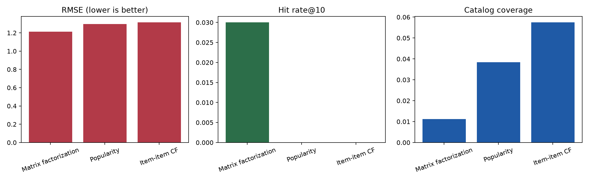
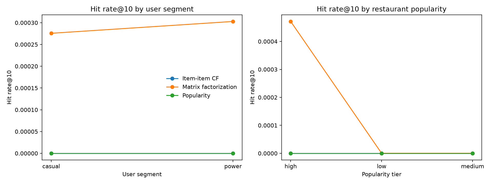
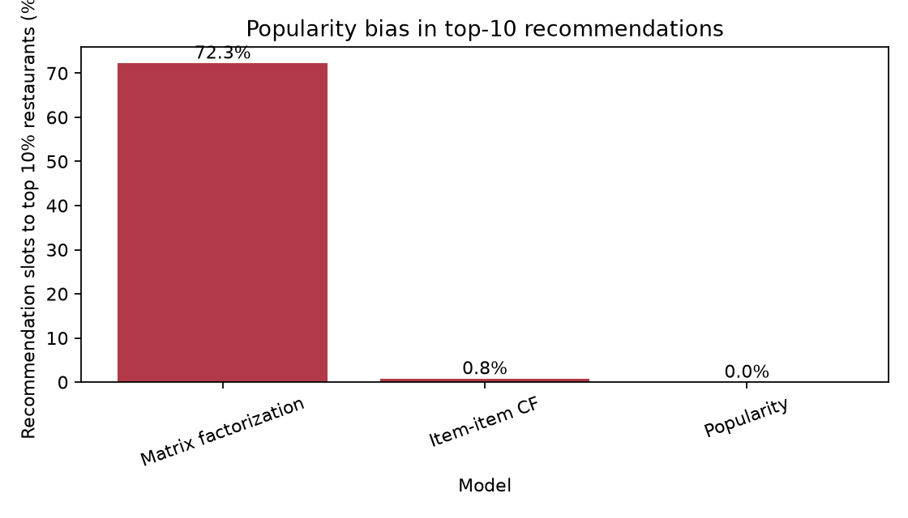

[](https://github.com/KyleZ8/restaurant-recommender/actions/workflows/ci.yml)

# Restaurant Recommender

## Headline Decision

Ship **matrix factorization for warm users only**, with a **popularity fallback for new users and new restaurants**, and validate it online before broad rollout. On a deterministic **5,000-user** Yelp evaluation sample that keeps every selected user's reviews, matrix factorization has the best RMSE (**1.2142**) and the only nonzero hit rate@10 (**3.0%**), but it sends **72.3%** of recommendation slots to the top 10% most-reviewed restaurants, so discovery diversity needs an explicit launch guardrail.

## Model Comparison

| Model | RMSE | Hit rate@10 | Catalog coverage | Decision |
|---|---:|---:|---:|---|
| Matrix factorization | 1.2142 | 3.0% | 1.12% | Ship to users with enough history, behind an experiment. |
| Popularity | 1.2976 | 0.0% | 3.84% | Use as cold-start fallback. |
| Item-item CF | 1.3139 | 0.0% | 5.74% | Do not ship; more discovery but weaker accuracy and no hits. |

Evaluation uses a deterministic user-level sample from the 5-core filtered Yelp table: **5,000 users**, **67,657 reviews**, **8,200 restaurants**, **13.53 ratings/user**, and **8.25 ratings/restaurant**. This keeps collaborative-filtering density intact instead of thinning the data with a random row sample.



## Segment Breakdown

| Segment | Best model | RMSE | Hit rate@10 | Coverage |
|---|---|---:|---:|---:|
| Casual users | Matrix factorization | 1.3880 | 0.03% | 0.29% |
| Power users | Matrix factorization | 1.1439 | 0.03% | 1.12% |
| High-popularity restaurants | Matrix factorization | 1.1355 | 0.05% | 1.52% |
| Low-popularity restaurants | Matrix factorization | 1.4346 | 0.00% | 0.44% |
| Medium-popularity restaurants | Matrix factorization | 1.3212 | 0.00% | 0.56% |



Cold-start is the failure mode: for new users, all models fall back to the same no-history estimate (**1.2428** RMSE). For warm users, matrix factorization improves RMSE to **1.1885** versus **1.3103** for popularity.

## Popularity Bias



Matrix factorization sends **72.3%** of recommendation slots to the top 10% most-reviewed restaurants, compared with **0.8%** for item-item CF and **0.0%** for popularity in the evaluated top-10 lists. That concentration is the main guardrail risk: the model improves warm-user accuracy and ranking hits, but it can narrow discovery toward already-visible restaurants.

## How to Get the Data and Run

The Yelp Open Dataset is **not included** in this repository. Yelp's dataset terms do not allow redistribution, so this repo commits only a tiny synthetic fixture for tests.

1. Download the Yelp Open Dataset from Yelp after accepting its terms.
2. Extract the JSON files outside the repo, for example `~/yelp_dataset/`.
3. Run:

```bash
make setup
make data SOURCE_DIR=/path/to/yelp_dataset
make notebooks
make test
```

`make data` filters to Pennsylvania restaurants and writes gitignored Parquet files under `data/processed/`. `make notebooks` executes the data, model, and segment-evaluation notebooks against those local files. CI runs only fixture tests.

## Limitations

- The notebook evaluates a large deterministic user-level sample, not the full 398,432-row 5-core table, to keep local reruns fast while preserving user-history density.
- Neural matrix factorization is out of scope for this portfolio run; the shipped comparison covers popularity, item-item collaborative filtering, and SGD matrix factorization.
- The recommender uses explicit star ratings; it does not include session context, distance, open hours, cuisine filters, or text/image features.
- New users and new restaurants need a fallback because collaborative signals are unavailable or sparse.
- The real Yelp data and processed Parquet files are intentionally gitignored and must never be committed.
